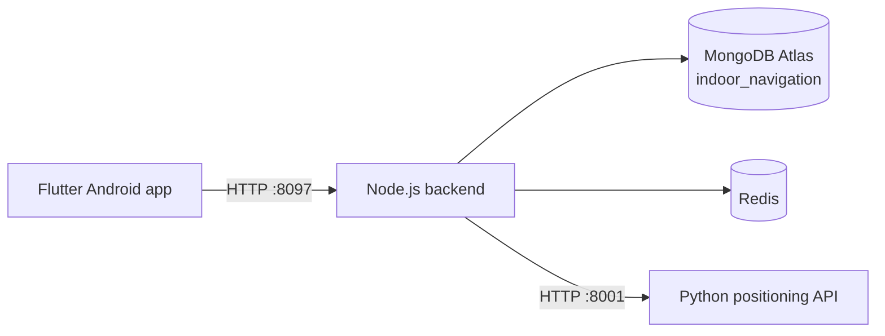

# MFU SmartGuide

MFU SmartGuide is an Android indoor-navigation prototype for Mae Fah Luang University. It combines a Flutter application, Node.js backend, Python positioning service, Redis, and MongoDB Atlas.

The system estimates a user's **zone-level position** from the connected Wi-Fi access point and optional AP1/AP2/AP3 RSSI scan. It then calculates a wall-safe route on an occupancy grid. The result is an indoor estimate, not GPS or exact point-level tracking.

## System overview



Current features include:

- separate User and Admin login flows with revocable sessions;
- room search with suggestions and selectable destinations;
- favorites and navigation from the Favorite page;
- Android connected-AP/BSSID and RSSI observations;
- optional three-AP readings, median filtering, and roaming hysteresis;
- A* routing with wall and diagonal-corner validation;
- user app-issue reports and administrator report review;
- administrator dashboard and map-data management;
- Docker Compose startup for backend, positioning model, and Redis.

## Important limitations

- Wi-Fi positioning is currently an approximate zone-level estimate.
- The current release does not connect to the Cisco Controller.
- Marker movement depends on accepted Wi-Fi observations; it does not track every physical step.
- Python positioning sessions are held in memory and are cleared when its container restarts.
- Emergency Alert cards in the Admin interface are demonstration data, not a completed real-time emergency service.
- MongoDB Atlas is external and is not started by Docker Compose.

## Repository structure

```text
MFUguiding/
├── frontend/           Flutter Android application
├── backend-node/       Node.js REST API and MongoDB models
├── model/              Python positioning and routing service
├── docs/               Project, API, database and operating documents
├── docker-compose.yml  Backend/model/Redis orchestration
└── RUN_FULL_SYSTEM.md  Detailed local handover and run guide
```

## Prerequisites

- Git
- Docker Desktop with Docker Compose
- a MongoDB Atlas cluster reachable from the reviewer's network
- Flutter and Android tooling only when building or modifying the APK
- an Android phone connected to `AS-Project` for live positioning tests

## Quick start with Docker

### 1. Clone and enter the repository

```powershell
git clone <gitlab-repository-url>
cd MFUguiding
```

### 2. Create the private backend environment file

```powershell
Copy-Item backend-node/.env.example backend-node/.env
```

Edit `backend-node/.env` and set at least:

```env
MONGODB_ATLAS=mongodb+srv://<username>:<url-encoded-password>@<cluster-host>/indoor_navigation?retryWrites=true&w=majority
INDOOR_NAVIGATION_DB=indoor_navigation
MOBILE_USER_EMAIL=user@example.invalid
MOBILE_USER_PASSWORD=<strong-local-password>
MOBILE_ADMIN_EMAIL=admin@example.invalid
MOBILE_ADMIN_PASSWORD=<strong-local-password>
```

The `.env` file is ignored by Git. Supply credentials to the reviewer through a separate secure channel. Add the reviewer's current public IP to MongoDB Atlas Network Access with the minimum necessary access period.

### 3. Build and start the services

```powershell
docker compose up -d --build
docker compose ps
```

Expected services: `backend`, `model`, and `redis`, all healthy.

### 4. Seed reference data and local test accounts

```powershell
docker compose exec backend npm run seed:navigation-map
docker compose exec backend npm run seed:mobile-users
```

Run seeds only against the intended `indoor_navigation` database. The map seed creates or updates one floor, three destinations, three APs, and three zones.

### 5. Verify health

```powershell
curl.exe http://127.0.0.1:8097/healthz
curl.exe http://127.0.0.1:8097/api/v1/navigation/health
curl.exe http://127.0.0.1:8001/health
```

The first endpoint should return `OK`; navigation dependencies and the Python model should report `status: ok`.

### 6. Stop or restart

```powershell
docker compose stop
docker compose start
```

To stop and remove containers while preserving the named Redis volume:

```powershell
docker compose down
```

Do not use `docker compose down -v` unless deleting local Docker data is intentional.

## Run the Android app

The installed APK must use a backend address reachable from the phone. First find the computer's current IPv4 address:

```powershell
ipconfig
```

Open this URL in the phone browser:

```text
http://<computer-ip>:8097/healthz
```

If it shows `OK`, build the APK:

```powershell
cd frontend
flutter clean
flutter pub get
flutter build apk --release --dart-define=BACKEND_BASE_URL=http://<computer-ip>:8097
```

Output:

```text
frontend/build/app/outputs/flutter-apk/app-release.apk
```

An APK embeds this URL at build time. If DHCP changes the computer IP, rebuild with the new reachable address. USB development and emulator alternatives are documented in `RUN_FULL_SYSTEM.md`.

## Automated verification

With Docker services running:

```powershell
docker compose exec model python -m unittest discover -s tests -v
docker compose exec backend npm run test:navigation
```

For Flutter development:

```powershell
cd frontend
flutter analyze
flutter test
```

Complete the manual checks in [`docs/ACCEPTANCE-TESTS.md`](docs/ACCEPTANCE-TESTS.md) before describing the project as ready for examination.

## Documentation

| Document | Purpose |
|---|---|
| [`docs/PROJECT-OVERVIEW.md`](docs/PROJECT-OVERVIEW.md) | scope, features, limitations, and validation summary |
| [`docs/ARCHITECTURE.md`](docs/ARCHITECTURE.md) | components, data flow, positioning and routing architecture |
| [`docs/DOCKER-GUIDE.md`](docs/DOCKER-GUIDE.md) | complete Docker setup and troubleshooting |
| [`docs/API-REFERENCE.md`](docs/API-REFERENCE.md) | backend endpoints, access levels, requests, and responses |
| [`docs/DATABASE-SCHEMA.md`](docs/DATABASE-SCHEMA.md) | MongoDB collections, fields, indexes, and relationships |
| [`docs/MODEL-DOCUMENTATION.md`](docs/MODEL-DOCUMENTATION.md) | positioning pipeline, routing, configuration, and calibration |
| [`docs/USER-ADMIN-MANUAL.md`](docs/USER-ADMIN-MANUAL.md) | User and Admin operating manual |
| [`docs/ACCEPTANCE-TESTS.md`](docs/ACCEPTANCE-TESTS.md) | release and examination test checklist |
| [`RUN_FULL_SYSTEM.md`](RUN_FULL_SYSTEM.md) | detailed local commands and project handover notes |

## Security and repository rules

Never commit:

- `.env` or `.env.local` files;
- MongoDB URIs, database passwords, API keys, or Bearer tokens;
- real seeded user passwords;
- Android signing keys or production service configuration;
- screenshots containing credentials or personal identifiers.

Before pushing, run:

```powershell
git status --short
git diff --check
git diff --cached
```

Rotate any credential that has previously appeared in source code, terminal screenshots, chat, or Git history. Removing a secret from the latest file does not remove it from earlier commits.

## License and academic use

No open-source license is currently declared. Unless the project owner adds one, treat the repository as an academic project shared only with authorized reviewers.
