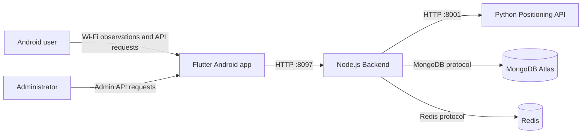
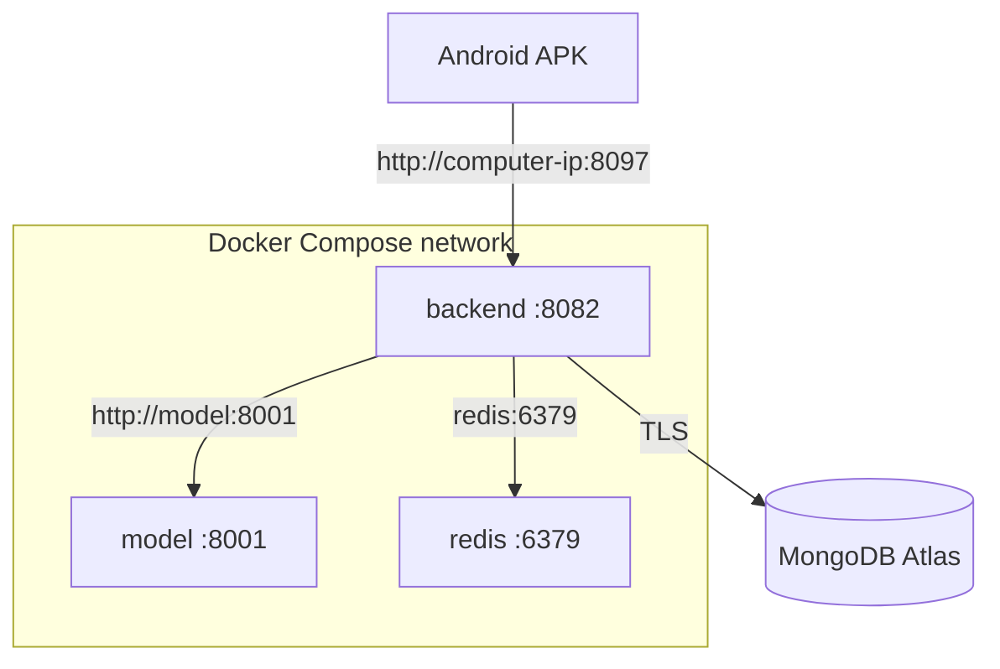
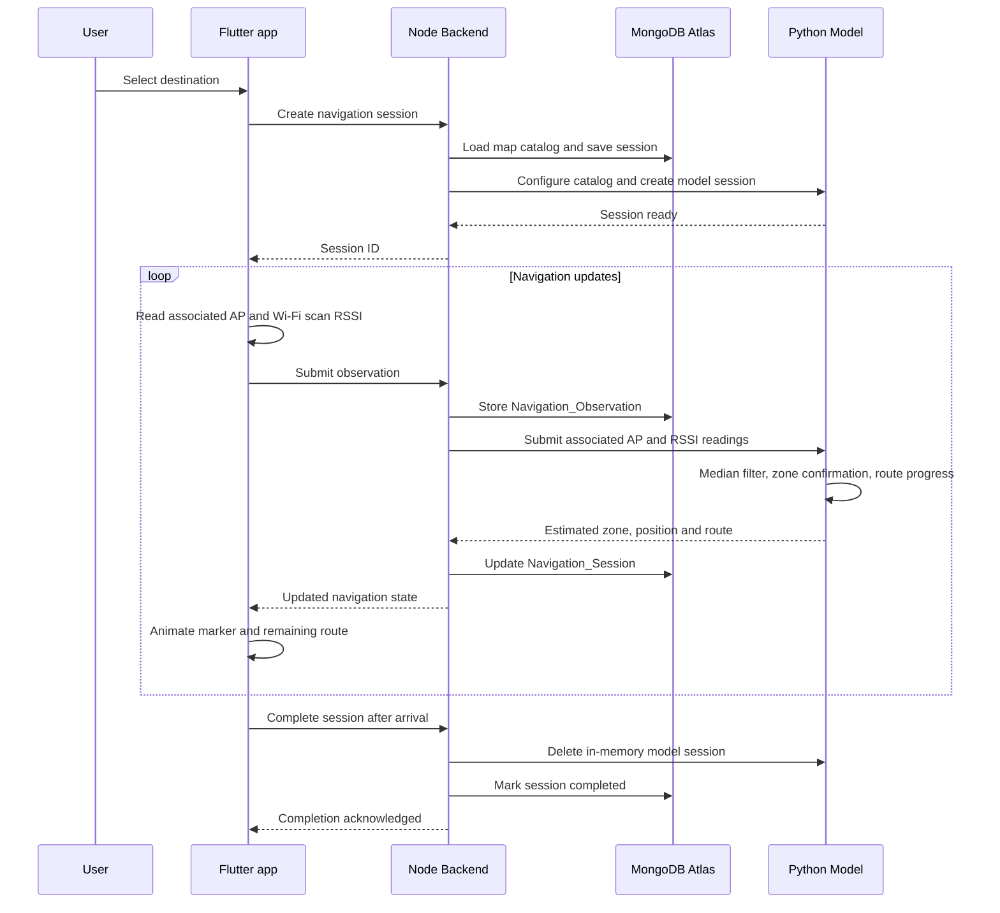
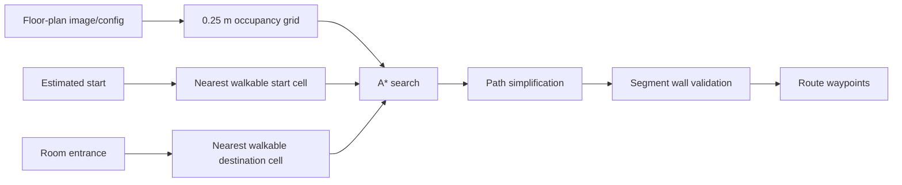

# MFU SmartGuide Architecture

## System context



The phone communicates only with the Node.js Backend. It does not directly
connect to MongoDB, Redis, or the Python Model.

## Docker deployment



Host port mappings:

| Host address | Container | Use |
|---|---|---|
| `0.0.0.0:8097` | `backend:8082` | Computer and Android phone access |
| `127.0.0.1:8001` | `model:8001` | Local health/API inspection |
| Not published | `redis:6379` | Compose-internal access only |

The Backend must call `http://model:8001` inside Compose. Using
`127.0.0.1:8001` from the Backend container would incorrectly address the
Backend container itself.

## Repository structure

```text
MFUguiding/
|-- frontend/                 Flutter Android application
|   |-- lib/                  Screens, services, API clients, map rendering
|   `-- android/              Kotlin Wi-Fi and motion platform integration
|-- backend-node/             Node.js Backend API
|   |-- server/Project/       Project modules
|   |-- scripts/              Database seed and operational scripts
|   `-- Dockerfile
|-- model/                    Python Positioning API and route engine
|   |-- positioning/          Filtering, roaming, zone and session logic
|   |-- navigation/           Occupancy-grid A* routing
|   |-- floorplan/            Grid/configuration assets
|   |-- models/               Trained joblib artifacts
|   |-- tests/                Model and routing tests
|   `-- Dockerfile
|-- docs/                     Reviewer and technical documentation
`-- docker-compose.yml        Redis + Model + Backend orchestration
```

## Runtime navigation sequence



## Initial position state

1. The App creates a session without inventing a starting coordinate.
2. A loading overlay remains while Wi-Fi observations are collected.
3. The App sends the associated AP and available known-AP RSSI values.
4. The Model filters values and confirms the initial zone.
5. The initial marker uses a walkable zone/hallway anchor.
6. The Backend returns a wall-safe route from that estimate to the selected
   destination.

## Wi-Fi acquisition

The Android native layer exposes a Flutter method channel for:

- connected Wi-Fi information;
- Wi-Fi scan results;
- accelerometer motion state.

Known BSSID prefixes are mapped to logical AP1/AP2/AP3 identifiers in the
Flutter service. Android can throttle active scanning; when a scan cannot be
started, the native layer returns the latest available cached scan results.

## Positioning pipeline

```mermaid
flowchart LR
    Raw[Raw AP and RSSI] --> Validate[RSSI validation]
    Validate --> Median[Median window]
    Median --> Candidate[Nearest AP candidate]
    Candidate --> Margin[4 dB switch margin]
    Margin --> Confirm[Roaming confirmations]
    Confirm --> Zone[Confirmed zone]
    Zone --> Anchor[Walkable zone anchor]
    Anchor --> Route[Monotonic route position]
```



Important configuration values from `model/positioning/zone_config.json`:

| Setting | Value | Meaning |
|---|---:|---|
| RSSI window | 5 | Median-filter window per AP |
| Normal roaming confirmations | 3 | Observations required to change zone |
| Reverse roaming confirmations | 5 | Stronger guard against rapid reversal |
| Nearest AP switch margin | 4 dB | Prevents changes for small RSSI differences |
| Stable zone navigation | Enabled | Keeps the zone stable until confirmation |
| Route snap tolerance | 1.5 m | Maximum normal offset before route snapping |
| Arrival guard radius | 1.5 m | Destination evidence area |
| Arrival confirmations | 3 | Stable observations required near destination |

## Routing pipeline



Diagonal movement is accepted only if its side-adjacent cells are also safe.
If a simplified segment crosses a blocked cell, the service retains the safe
grid path instead of the unsafe shortcut.

## Marker and route rendering

- The map camera follows the estimated marker at a fixed map orientation.
- Marker changes are animated rather than teleported.
- The visible blue line begins at the marker's closest point on the remaining
  route.
- Waypoints behind the marker are discarded from the visible route.
- Signal noise cannot reduce monotonic progress on the same route.
- Backend completion errors from an already completed session do not replace
  the arrival state with a connection-error screen.

## Backend module boundaries

| Module | Responsibility |
|---|---|
| `mobile-auth` | Mobile login, role, session creation and expiration |
| `mobile-content` | Favorites, user reports and Admin report workflow |
| `navigation` | Map catalog, observations, sessions and Model orchestration |
| `database` | MongoDB connection for `indoor_navigation` |
| `config` | Runtime environment and legacy project configuration |

## Database ownership

The Backend is the only component that writes persistent application data.
The Model receives a runtime catalog and keeps active positioning state in one
Python process. This is why the Model container deliberately runs one Uvicorn
worker.

| Collection | Owner/use |
|---|---|
| `Mobile_Users` | User/Admin credentials and roles |
| `Mobile_Sessions` | Login sessions and expiration |
| `Mobile_Favorites` | Saved destinations |
| `Mobile_Reports` | Reports and Admin status updates |
| `Navigation_Floors` | Floor metadata and map reference |
| `Navigation_Destinations` | Room entrances |
| `Navigation_Access_Points` | AP identity, position and zone |
| `Navigation_Zones` | Zone labels and anchors |
| `Navigation_Sessions` | Persistent navigation state |
| `Navigation_Observations` | Associated AP and RSSI history |

## Failure behavior

| Failure | Expected behavior |
|---|---|
| MongoDB unavailable | Backend health becomes unavailable; persistent operations fail |
| Model unavailable | Navigation health reports positioning unavailable |
| Redis unavailable | Compose waits for Redis; Backend is not started until Redis is healthy |
| One AP unavailable | Positioning confidence/coverage decreases; remaining readings may still identify a coarse zone |
| Android scan throttled | Cached scan results are used when available |
| Phone cannot reach host | Login/API requests time out; verify IP, network isolation and firewall |

## Security boundaries

- The APK never contains MongoDB credentials.
- MongoDB and seed passwords are injected through ignored environment files.
- Redis is not published to the host network.
- The Model host port is bound to loopback by default.
- Only Backend port 8097 is exposed to the local network for Android testing.
- User/Admin authorization is enforced by the Backend, not only by UI routing.

## Related documentation

- [Project overview](PROJECT-OVERVIEW.md)
- [Docker guide](DOCKER-GUIDE.md)
- [Backend API reference](API-REFERENCE.md)
