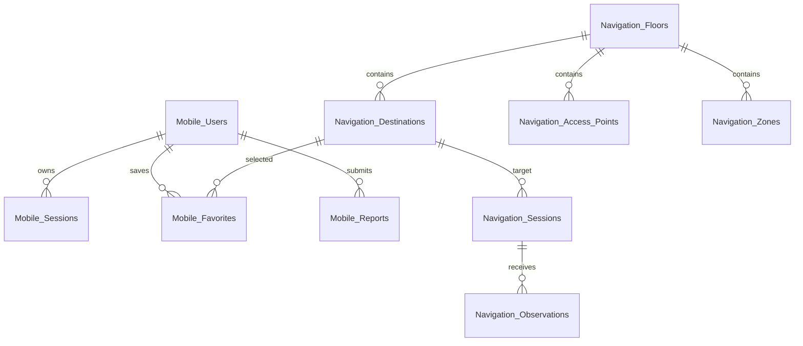

# MFU SmartGuide Database Schema

## Overview

The backend stores application and indoor-navigation data in MongoDB. The target database is selected by `INDOOR_NAVIGATION_DB` and defaults to `indoor_navigation`. The MongoDB URI must be supplied through an ignored environment file; never commit credentials.

All coordinates use floor-map metres and have the form `{ "x": Number, "y": Number }`.

## Collections

| Collection | Purpose | Primary application key |
|---|---|---|
| `Mobile_Users` | User and administrator accounts | `email` |
| `Mobile_Sessions` | Login sessions | `tokenHash` |
| `Mobile_Favorites` | Saved destinations | `userId + destinationId` |
| `Mobile_Reports` | App/system reports from users | MongoDB `_id` |
| `Navigation_Floors` | Floor image and coordinate metadata | `floorId` |
| `Navigation_Destinations` | Searchable rooms and entrances | `destinationId` |
| `Navigation_Access_Points` | AP identity, zone and anchors | `apId` |
| `Navigation_Zones` | Zone labels and AP transitions | `zoneId` |
| `Navigation_Sessions` | Current and completed navigation state | `sessionId` |
| `Navigation_Observations` | Time-series Wi-Fi observations | MongoDB `_id` |

## Authentication collections

### `Mobile_Users`

| Field | Type | Rules |
|---|---|---|
| `email` | String | required, unique, lowercase, trimmed, indexed |
| `passwordHash` | String | required; never return or log it |
| `passwordSalt` | String | required; never return or log it |
| `role` | String | `user` or `admin`; default `user`; indexed |
| `active` | Boolean | default `true` |
| `createdAt`, `updatedAt` | Date | application timestamps |

Passwords are stored as a salt and derived hash, not plaintext. Rotating the MongoDB database password is separate from changing a mobile user's password.

### `Mobile_Sessions`

| Field | Type | Rules |
|---|---|---|
| `tokenHash` | String | required, unique, indexed; raw tokens are not stored |
| `userId` | ObjectId | required, indexed; references `Mobile_Users._id` |
| `expiresAt` | Date | required; TTL index automatically removes expired records |
| `createdAt` | Date | default current time |
| `revokedAt` | Date/null | set when the user signs out or the session is revoked |

### `Mobile_Favorites`

| Field | Type | Rules |
|---|---|---|
| `userId` | ObjectId | required, indexed; references `Mobile_Users._id` |
| `destinationId` | String | required; references `Navigation_Destinations.destinationId` |
| `tag` | String | `Home`, `Study`, or `Others`; default `Others` |
| `createdAt` | Date | default current time |

The compound unique index on `{ userId, destinationId }` prevents a duplicate favorite for one user.

### `Mobile_Reports`

Fields are `userId`, `reporterEmail`, `type`, `location`, `description`, optional `navigationSessionId`, optional `estimatedPosition`, `status`, `createdAt`, and `updatedAt`. Status is one of `pending`, `approved`, `rejected`, `in_progress`, or `resolved`. The admin report list uses the indexes on status and creation time.

## Map collections

### `Navigation_Floors`

Contains `floorId`, `buildingId`, `label`, `imageAsset`, positive `imageWidth` and `imageHeight`, positive `cellSizeMeters`, `xRange`, `yRange`, affine `transform` (`a`, `b`, `c`, `d`), `active`, and timestamps. `floorId` is unique.

### `Navigation_Destinations`

Contains unique `destinationId`, `floorId`, `label`, optional `nameTh`, required `nameEn`, optional indexed `roomNumber`, `category`, `searchKeywords`, required `position`, `active`, and timestamps. A MongoDB text index covers label, Thai/English names, room number, and keywords.

### `Navigation_Access_Points`

Contains unique `apId`, `floorId`, optional indexed `bssid`, physical `position`, `zoneId`, hallway `startAnchor`, three signal anchors (`near`, `medium`, `edge`), `active`, optional `lastSeenAt`, and timestamps. The physical AP position and navigation start anchor intentionally serve different purposes.

### `Navigation_Zones`

Contains unique `zoneId`, `floorId`, `label`, `active`, timestamps, and zero or more transitions. Each transition contains `fromAp`, `toAp`, and a walkable `position` used when roaming is confirmed.

## Runtime navigation collections

### `Navigation_Sessions`

Stores `sessionId`, `userId`, `clientId`, `destinationId`, optional start/current position metadata, step and distance counters, AP/zone/RSSI state, confidence, route waypoints, route version, observation timestamps, completion timestamp, and automatic `createdAt`/`updatedAt`.

`status` is `active`, `completed`, `cancelled`, or `expired`. `observationStatus` is `waiting`, `fresh`, `stale`, or `unavailable`. Partial compound indexes support looking up active sessions by user or client.

### `Navigation_Observations`

| Field | Type | Meaning |
|---|---|---|
| `sessionId` | String/null | navigation session receiving the sample |
| `clientId` | String | installation/client identifier |
| `associatedAp` | String | AP currently associated with the phone |
| `rssi` | Number | associated AP signal in dBm |
| `rssiReadings` | Map<String, Number>/null | optional scan containing several AP readings |
| `timestamp` | Date | time measured on the client |
| `receivedAt` | Date | time accepted by the backend |
| `source` | String | default `mobile_connected_ap` |
| `valid` | Boolean | validation result |
| `validationError` | String/null | reason an observation was rejected |
| `externalObservationId` | String/null | optional sparse, unique idempotency key |

Indexes support newest-first queries by session, client, and AP.

## Relationships



These are application-level references; most are strings rather than Mongoose `ref` relationships. The service must validate referenced records.

## Safe example

```json
{
  "sessionId": "nav-example",
  "clientId": "mfu-flutter-example",
  "associatedAp": "AP2",
  "rssi": -63,
  "rssiReadings": { "AP1": -72, "AP2": -63, "AP3": -79 },
  "source": "mobile_connected_ap",
  "valid": true
}
```

## Seed and inspection

With the Docker stack running:

```powershell
docker compose exec backend npm run seed:navigation-map
docker compose exec backend npm run seed:mobile-users
```

Use MongoDB Atlas Data Explorer and select the database configured by `INDOOR_NAVIGATION_DB`. If collections do not appear, verify the database name and refresh Data Explorer. Seed scripts update the map reference data; back up production data before changing seed behavior.

Do not copy `.env`, database credentials, token hashes, password hashes, or real observation identifiers into GitLab documentation or screenshots.
